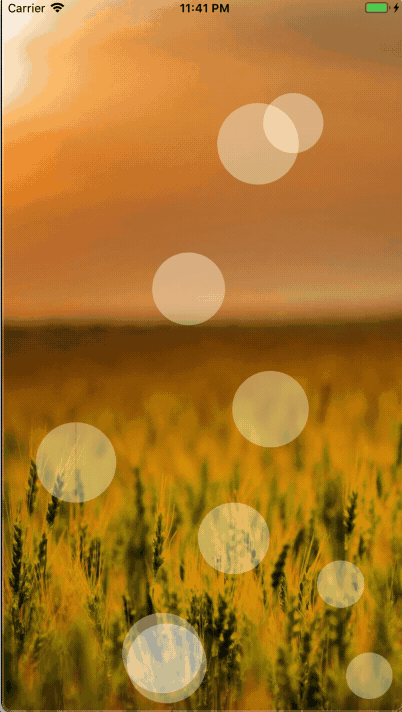
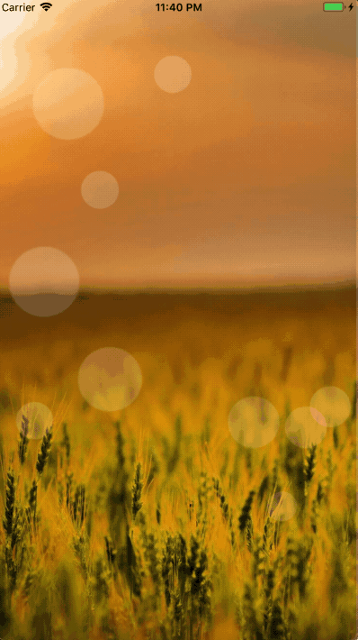

# react-native-bouncing-ball

react native component bouncing ball for both iOS and Android

## Demo

Use the `<Image/>` generate ball



Use the `<View/>` generate ball



## Install

`npm i react-native-bouncing-ball --save`

## Usage

Use the `<Image/>` generate ball

```javascript
import React, {PureComponent} from 'react';
import { StyleSheet, ImageBackground} from 'react-native';
import BouncingBalls from 'react-native-bouncing-ball'

export default class BouncingBallsComponent extends PureComponent {
  render() {
    return (
      <ImageBackground style={styles.container} source={require('./images/background.jpg')}>
        <BouncingBalls
          amount={10}
          animationDuration={5000}
          minSpeed={30}
          maxSpeed={200}
          minSize={40}
          maxSize={100}
          imageCircle={require('./images/bouncing_ball.png')}
         />
      </ImageBackground>
    );
  }
}

const styles = StyleSheet.create({
  container: {
    flex: 1,
    justifyContent: 'center',
    alignItems: 'center',
  }
});

```

Use the `<View/>` generate ball

```javascript
import React, {PureComponent} from 'react';
import { StyleSheet, ImageBackground} from 'react-native';
import BouncingBalls from 'react-native-bouncing-ball'

export default class BouncingBallsComponent extends PureComponent {
  render() {
    return (
      <ImageBackground style={styles.container} source={require('./images/background.jpg')}>
        <BouncingBalls
          amount={10}
          animationDuration={5000}
          minSpeed={30}
          maxSpeed={200}
          minSize={40}
          maxSize={100}
          style={{
            backgroundColor: '#CDFFCD'
          }}
         />
      </ImageBackground>
    );
  }
}

const styles = StyleSheet.create({
  container: {
    flex: 1,
    justifyContent: 'center',
    alignItems: 'center',
  }
});

```

## API

| Props | PropType | Default Value | Description |
| ----- | --------- | ------------| ------------- | 
| amount | `number` |  1 | the number of balls |
| animationDuration | `number` |  5000 | Every section animation time |
| minSpeed | `number` |  30 | The slowest speed of the ball |
| maxSpeed | `number` |  200 | The fastest speed of the ball |
| minSize | `number` |  40 | The largest ball size |
| maxSize | `number` |  100 | The smallest ball size |
| style | `object` |  null | The style of the ball |
| imageCircle | `object` | null | Choose `View` or `Image` generate ball|

## LICENCE

MIT

