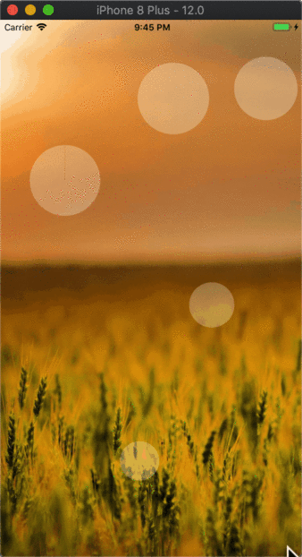
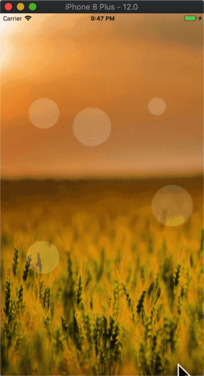

# react-native-bouncing-ball

react native component bouncing ball for both iOS and Android

## Demo




## Install

`npm i react-native-bouncing-ball --save`

## Usage

```
import React, {PureComponent} from 'react';
import {Platform, StyleSheet, Text, View} from 'react-native';
import BouncingBalls from 'react-native-bouncing-ball'

export default class BouncingBallsComponent extends PureComponent {
  render() {
    return (
      <View style={styles.container}>
        <BouncingBalls
          amount={5}
          animationDuration={5000}
          minSpeed={10}
          maxSpeed={100}
          minSize={40}
          maxSize={100}
          style={{
            backgroundColor: 'red'
          }}
      />
      </View>
    );
  }
}

const styles = StyleSheet.create({
  container: {
    flex: 1,
    justifyContent: 'center',
    alignItems: 'center',
    backgroundColor: '#000',
  }
});

```

## Props

| Props | PropType | Default Value | Description |
| ----- | --------- | ------------| ------------- | 
| amount | number |  1 | Number of ball |
| animationDuration | number |  5000 | Duration of the animation |
| minSpeed | number |  10 | Minimum speed |
| maxSpeed | number |  100 | Maximum speed |
| minSize | number |  40 | Minimum size |
| maxSize | number |  100 | Maximum size |
| style | object |  null | style of balls |
| imageCircle | func | `require('./xxx.png')` | Use the image, instead of `View`|

## LICENCE

MIT

